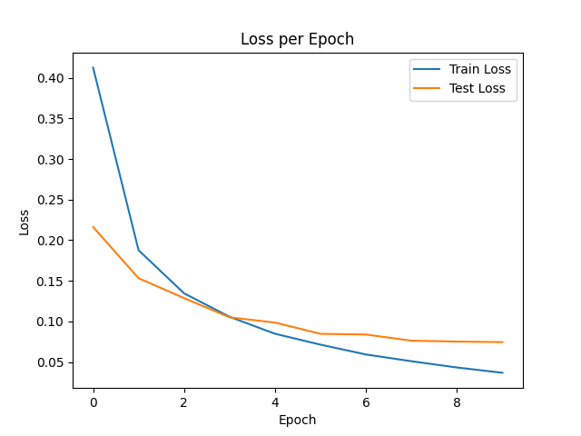
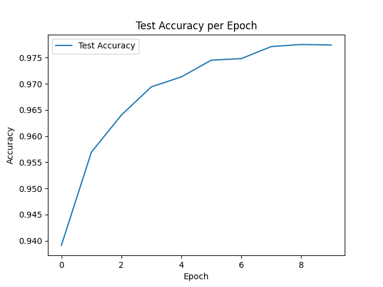
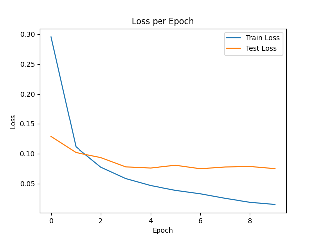
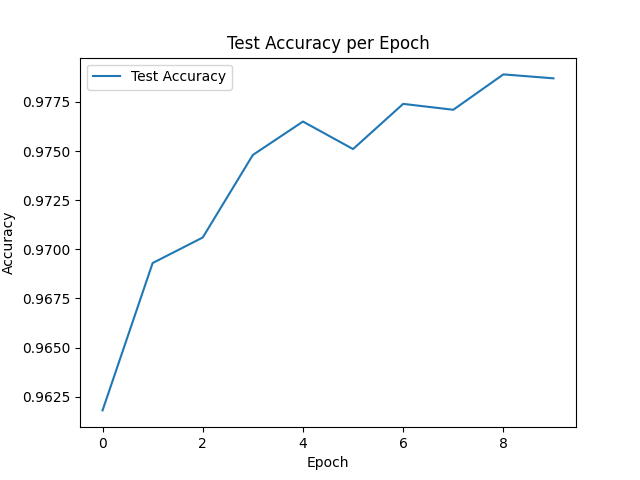

# MNIST Classification (First Deep Learning Project)

This project is my first end-to-end deep learning model built from scratch using
PyTorch.  
The goal was to understand how neural networks actually work — not just run
ready code.

I trained a fully connected neural network (MLP) to classify handwritten digits
from the MNIST dataset.

---

## What I learned in this project

- How DataLoader works (batches, shuffling, train/test split)
- Why we flatten images for fully connected layers
- How forward pass works inside nn.Module
- How loss.backward() computes gradients
- Why we call optimizer.zero_grad()
- Difference between Adam and SGD with momentum
- How to detect overfitting using loss curves
- How to structure a small ML project properly

This repository intentionally keeps early notebooks to show my learning process
step by step.

---

## Model Architecture

Fully Connected Neural Network:

- Input: 28x28 image → flattened to 784
- Hidden layer: 128 neurons
- Activation: ReLU
- Output: 10 classes (digits 0–9)

Loss: CrossEntropyLoss  
Optimizers tested:

- Adam
- SGD (momentum=0.9)

---

## Results

Both optimizers achieved around **97–98% test accuracy**.

Example result (SGD with momentum): { "optimizer": "SGD", "lr": 0.1, "momentum":
0.9, "epochs": 10, "hidden": 128, "final_test_acc": 0.9787 }

## Training Curves

### Adam




### SGD

 

## Project Structure

mnist_classification/ │ ├── notebooks/ # Step-by-step learning process ├──
src/ # Refactored reusable code ├── assets/ # Training curves ├──
requirements.txt └── README.md

- Early notebooks show the full reasoning process.
- `src/` contains the clean version of model and training logic.
- `03_refactor_clean_pipeline.ipynb` demonstrates structured usage of modules.

## Installation

Clone the repo and install dependencies:

```bash
pip install -r requirements.txt


Run the refactored notebook:
notebooks/03_refactor_clean_pipeline.ipynb
```
